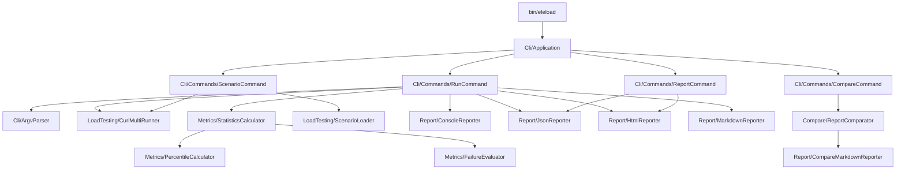

# Architecture

> **Also available in:** [日本語](../ja/architecture.md)

## Overview

`eleload` is a zero-dependency PHP 8.2+ CLI tool. All functionality lives inside `src/` and is
invoked through a single entry point `bin/eleload`.

## Component Diagram



## Directory Structure

```
src/
├── Cli/
│   ├── Application.php           Entry point — dispatches commands
│   ├── ArgvParser.php            Parses argv into strongly-typed option objects
│   ├── ConsoleOutput.php         STDOUT/STDERR abstraction
│   ├── RunOptions.php            Value object for `run` options
│   ├── CompareOptions.php        Value object for `compare` options
│   ├── ReportOptions.php         Value object for `report` options
│   └── Commands/
│       ├── RunCommand.php        Executes single-URL load tests
│       ├── ScenarioCommand.php   Executes multi-step scenario files
│       ├── ReportCommand.php     Regenerates reports from JSON
│       └── CompareCommand.php    Compares two JSON reports
├── LoadTesting/
│   ├── CurlMultiRunner.php       curl_multi executor; streams results to disk when needed
│   ├── ScenarioLoader.php        Loads and parses JSON/YAML scenario files
│   ├── RequestOptions.php        Per-request configuration value object
│   ├── RequestResult.php         Single request result (status, latency, error)
│   └── RunResult.php             Aggregated result container with optional disk spill
├── Metrics/
│   ├── StatisticsCalculator.php  Computes RPS, TPS, latency percentiles, thresholds
│   ├── PercentileCalculator.php  Exact percentile from sorted array
│   └── FailureEvaluator.php      Evaluates threshold conditions
├── Report/
│   ├── ConsoleReporter.php       Prints summary table to STDOUT
│   ├── JsonReporter.php          Writes machine-readable JSON report
│   ├── HtmlReporter.php          Renders HTML report via Blade-like templates
│   ├── MarkdownReporter.php      Writes Markdown summary
│   ├── CompareMarkdownReporter.php  Renders comparison reports
│   └── ReportPathGenerator.php   Generates timestamped file paths
├── Compare/
│   └── ReportComparator.php      Calculates metric diffs between two reports
└── bootstrap.php                 Autoloader bootstrap
```

## Key Design Decisions

### Memory-efficient result accumulation

`CurlMultiRunner` keeps request results in memory up to `--memory-buffer-size` (default: 10 000).
When that limit is reached, results are spilled to a temporary file on disk.

`StatisticsCalculator` detects whether spill occurred:

- **No spill**: exact percentiles via `PercentileCalculator` (sort-based)
- **Spill occurred**: approximate percentiles via a P² streaming estimator

This avoids OOM errors when running millions of requests while maintaining accurate metrics for typical test sizes.

### Security-first URL handling

`ArgvParser` validates URLs before any request is made:
- Only `http://` and `https://` schemes are accepted
- CRLF injection in headers is blocked
- `--block-private-networks` resolves the target host and rejects RFC-1918/loopback addresses

### Dual-format scenario support

`ScenarioLoader` dispatches to the appropriate parser by file extension:
- `.json` → built-in `json_decode`
- `.yaml` / `.yml` → `ext-yaml` (preferred) or `symfony/yaml` (fallback)

## Testing

Tests use a custom lightweight runner (`tests/run.php`) with a Pest-like DSL.
Run with:

```bash
composer test       # All tests
composer analyse    # PHPStan level 8 static analysis
composer cs-check   # PHP-CS-Fixer dry-run
```
