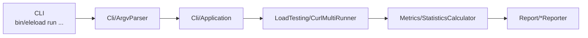
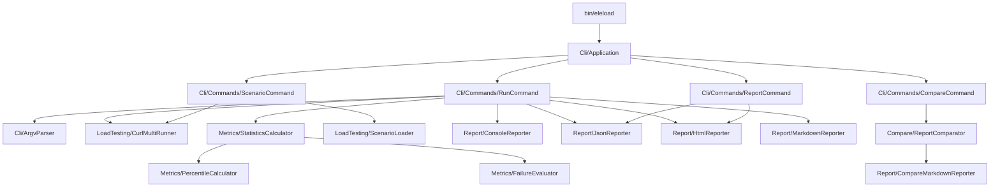

# アーキテクチャ

> **Also available in:** [English](../en/architecture.md)

## 概要

`eleload` は依存ゼロの PHP 8.2+ CLI ツールです。すべての機能は `src/` 内に収まり、
単一のエントリポイント `bin/eleload` から起動されます。

## コア実行パイプライン

`eleload run` の主要な実行経路は次のとおりです。



## データフロー

1. CLI がオペレーターから渡された引数を受け取ります。
2. `Cli/ArgvParser` がフラグを検証し、型付きオプションを生成します。
3. `Cli/Application` がコマンドをディスパッチし、依存関係を組み立てます。
4. `LoadTesting/CurlMultiRunner` が HTTP リクエストを実行して `RunResult` を収集します。
5. `Metrics/StatisticsCalculator` が生の結果を集計メトリクスへ変換します。
6. `Report/*Reporter` が結果をコンソール表示または各種レポートファイルへ出力します。

## クラス責務

| クラス | 主な責務 | 入力 | 出力 |
| ----- | ------- | ---- | ---- |
| `Cli/ArgvParser` | CLI フラグの解析と検証 | `argv` 配列 | `RunOptions` / `ScenarioRunOptions` など |
| `Cli/Application` | コマンドの振り分けと実行オーケストレーション | 解析済みコマンドとオプション | コマンド実行の副作用 |
| `LoadTesting/CurlMultiRunner` | 並列リクエスト実行と必要時のディスクスピル | URL とリクエスト設定 | `RunResult` |
| `Metrics/StatisticsCalculator` | スループット・レイテンシ・レート・しきい値関連の集計 | `RunResult` | 構造化メトリクス配列 |
| `Report/*Reporter` | 複数フォーマットでの表示・保存 | 集計済みレポートペイロード | コンソール出力またはレポートファイル |

## コンポーネント図



## ディレクトリ構造

```text
src/
├── Cli/
│   ├── Application.php           エントリポイント — コマンドをディスパッチ
│   ├── ArgvParser.php            argv を厳密に型付けされたオプションオブジェクトへ解析
│   ├── ConsoleOutput.php         STDOUT/STDERR の抽象化
│   ├── RunOptions.php            `run` オプションのバリューオブジェクト
│   ├── CompareOptions.php        `compare` オプションのバリューオブジェクト
│   ├── ReportOptions.php         `report` オプションのバリューオブジェクト
│   └── Commands/
│       ├── RunCommand.php        単一 URL 負荷試験を実行
│       ├── ScenarioCommand.php   マルチステップシナリオファイルを実行
│       ├── ReportCommand.php     JSON からレポートを再生成
│       └── CompareCommand.php    2 つの JSON レポートを比較
├── LoadTesting/
│   ├── CurlMultiRunner.php       curl_multi エグゼキュータ（必要に応じてディスクへスピル）
│   ├── ScenarioLoader.php        JSON/YAML シナリオファイルを読み込み・解析
│   ├── RequestOptions.php        リクエストごとの設定バリューオブジェクト
│   ├── RequestResult.php         単一リクエスト結果（ステータス・レイテンシ・エラー）
│   └── RunResult.php             オプションのディスクスピル付き集計結果コンテナ
├── Metrics/
│   ├── StatisticsCalculator.php  RPS・TPS・レイテンシパーセンタイル・しきい値を計算
│   ├── PercentileCalculator.php  ソート済み配列からの正確なパーセンタイル
│   └── FailureEvaluator.php      しきい値条件を評価
├── Report/
│   ├── ConsoleReporter.php       STDOUT にサマリーテーブルを表示
│   ├── JsonReporter.php          機械可読な JSON レポートを書き込み
│   ├── HtmlReporter.php          テンプレートを使って HTML レポートをレンダリング
│   ├── MarkdownReporter.php      Markdown サマリーを書き込み
│   ├── CompareMarkdownReporter.php  比較レポートをレンダリング
│   └── ReportPathGenerator.php   タイムスタンプ付きファイルパスを生成
├── Compare/
│   └── ReportComparator.php      2 つのレポート間のメトリクス差分を計算
└── bootstrap.php                 オートローダーのブートストラップ
```

## 主要な設計決定

### メモリ効率の良い結果の蓄積

`CurlMultiRunner` は `--memory-buffer-size`（デフォルト: 10 000）までリクエスト結果をメモリ内に保持します。
その上限に達すると、結果はディスク上の一時ファイルにスピルされます。

`StatisticsCalculator` はスピルが発生したかどうかを検出します:

- **スピルなし**: `PercentileCalculator` による正確なパーセンタイル（ソートベース）
- **スピルあり**: P² ストリーミング推定器による近似パーセンタイル

これにより、数百万リクエストの実行時の OOM エラーを防ぎながら、一般的なテストサイズでの正確なメトリクスを維持します。

### セキュリティファーストの URL 処理

`ArgvParser` はリクエスト送信前に URL を検証します:

- `http://` と `https://` スキームのみ受け入れ
- ヘッダーへの CRLF インジェクションをブロック
- `--block-private-networks` によりターゲットホストを解決し RFC-1918/ループバックアドレスを拒否

### デュアルフォーマットシナリオサポート

`ScenarioLoader` はファイル拡張子によって適切なパーサーにディスパッチします:

- `.json` → 組み込み `json_decode`
- `.yaml` / `.yml` → `ext-yaml`（優先）または `symfony/yaml`（フォールバック）

## テスト

テストはカスタムの軽量ランナー（`tests/run.php`）と Pest ライクな DSL を使用します。
実行方法:

```bash
composer test       # 全テスト
composer analyse    # PHPStan レベル 8 静的解析
composer cs-check   # PHP-CS-Fixer ドライラン
```
